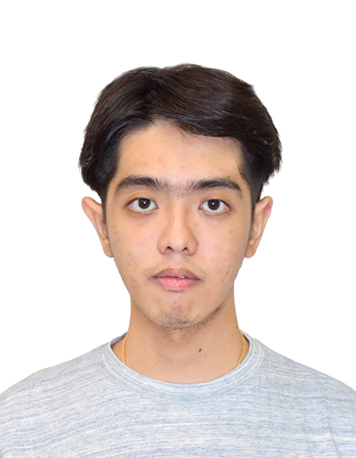
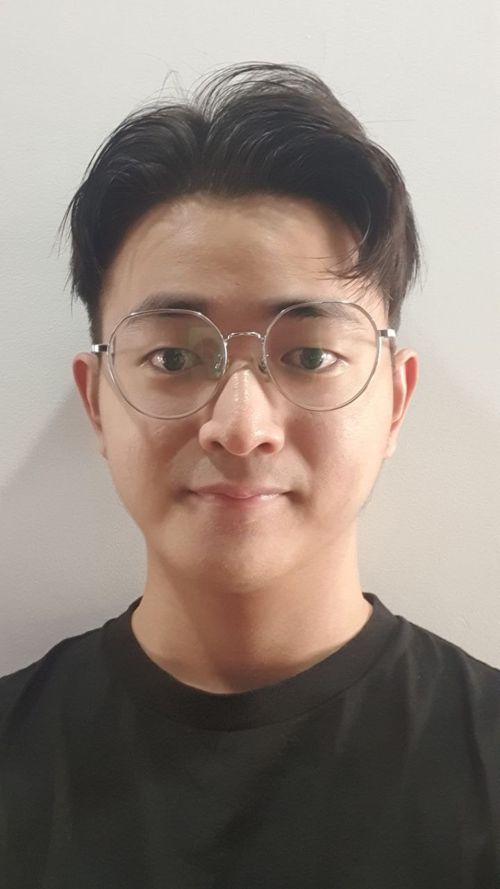
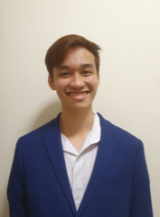
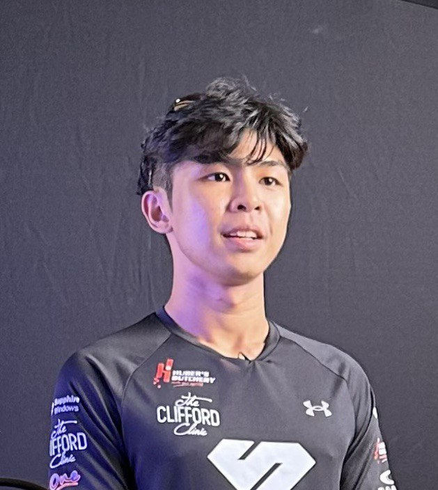

# About Us

We are a team based in the [School of Computing, National University of Singapore](http://www.comp.nus.edu.sg).

## Project team

### Ng Zhan Yang

[[github](https://github.com/zhanyang01)]
[[portfolio](team/zhanyang01.md)]

- Role: Developer
- Responsibilities: Deliverables and Deadlines, Scheduling and tracking

### Teng Xin Zhuan

[[github](http://github.com/aarontxz)]
[[portfolio](team/aarontxz.md)]

- Role: Developer
- Responsibilities: UI, Testing and fixing bugs

### Chang Ji-xuan

[[github](http://github.com/johnnythesnake12)]
[[portfolio](team/johnnythesnake12.md)]

- Role: Developer
- Responsibilities: Manual Testing of features, Deliverables and Deadlines

### Luah Jun Yang

[[github](http://github.com/luahjunyang)]
[[portfolio](team/luahjunyang.md)]

- Role: Developer
- Responsibilities: Documentation
