# InsuraHub Developer Guide

<!-- * Table of Contents -->
<page-nav-print />

---

# **Table of contents**

1. [Setting up, getting started](#setting-up-getting-started)
2. [Design](#design)
   1. [Architecture](#architecture)
   2. [UI Component](#ui-component)
   3. [Logic Component](#logic-component)
   4. [Model Component](#model-component)
   5. [Storage Component](#storage-component)
   6. [Common Classes](#common-classes)
3. [Implementation](#implementation)
4. [Acknowledgements](#acknowledgements)
5. [Appendix Requirements](#appendix-requirements)
   1. [Product Scope](#product-scope)
   2. [User Stories](#user-stories)
   3. [Use Cases](#use-cases)
      1. Adding more tags to client records
      2. Quick access of contact detail of clients
      3. Adding new clients information
      4. Filtering client information using tags
      5. Storing client documents neatly in a folder
      6. Grouping clients based on nearest MRT
   4. [Non-Functional Requirements](#non-functional-requirements)
   5. [Glossary](#glossary)
6. [Appendix-Instructions for Manual Testing](#appendix-instructions-for-manual-testing)
7. [Appendix-Planned Enhancements](#appendix-planned-enhancements)

## **Setting up, getting started**

Refer to the guide [_Setting up and getting started_](SettingUp.md).

Return to [Table Of Contents](#table-of-contents)

---

## **Design**

### Architecture

<puml src="diagrams/ArchitectureDiagram.puml" width="280" />
The **_Architecture Diagram_** given above explains the high-level design of the App.

Given below is a quick overview of main components and how they interact with each other.

**Main components of the architecture**

**`Main`** (consisting of classes [`Main`](https://github.com/AY2324S1-CS2103-W14-1/tp/blob/master/src/main/java/seedu/address/Main.java) and [`MainApp`](https://github.com/AY2324S1-CS2103-W14-1/tp/blob/master/src/main/java/seedu/address/MainApp.java)) is in charge of the app launch and shut down.

- At app launch, it initializes the other components in the correct sequence, and connects them up with each other.
- At shut down, it shuts down the other components and invokes cleanup methods where necessary.

The bulk of the app's work is done by the following four components:

- [**`UI`**](#ui-component): The UI of the App.
- [**`Logic`**](#logic-component): The command executor.
- [**`Model`**](#model-component): Holds the data of the App in memory.
- [**`Storage`**](#storage-component): Reads data from, and writes data to, the hard disk.

[**`Commons`**](#common-classes) represents a collection of classes used by multiple other components.

**How the architecture components interact with each other**

The _Sequence Diagram_ below shows how the components interact with each other for the scenario where the user issues the command `delete 1`.

<puml src="diagrams/ArchitectureSequenceDiagram.puml" width="574" />

Each of the four main components (also shown in the diagram above),

- defines its _API_ in an `interface` with the same name as the Component.
- implements its functionality using a concrete `{Component Name}Manager` class (which follows the corresponding API `interface` mentioned in the previous point.

For example, the `Logic` component defines its API in the `Logic.java` interface and implements its functionality using the `LogicManager.java` class which follows the `Logic` interface. Other components interact with a given component through its interface rather than the concrete class (reason: to prevent outside component's being coupled to the implementation of a component), as illustrated in the (partial) class diagram below.

<puml src="diagrams/ComponentManagers.puml" width="300" />

The sections below give more details of each component.

Return to [Table Of Contents](#table-of-contents)

### UI component

The **API** of this component is specified in [`Ui.java`](https://github.com/AY2324S1-CS2103-W14-1/tp/blob/master/src/main/java/seedu/address/ui/Ui.java)

<puml src="diagrams/UiClassDiagram.puml" alt="Structure of the UI Component"/>

The UI consists of a `MainWindow` that is made up of parts e.g.`CommandBox`, `ResultDisplay`, `PersonListPanel`, `StatusBarFooter` etc. All these, including the `MainWindow`, inherit from the abstract `UiPart` class which captures the commonalities between classes that represent parts of the visible GUI.

The `UI` component uses the JavaFx UI framework. The layout of these UI parts are defined in matching `.fxml` files that are in the `src/main/resources/view` folder. For example, the layout of the [`MainWindow`](https://github.com/AY2324S1-CS2103-W14-1/tp/blob/master/src/main/java/seedu/address/ui/MainWindow.java) is specified in [`MainWindow.fxml`](https://github.com/AY2324S1-CS2103-W14-1/tp/blob/master/src/main/resources/view/MainWindow.fxml)

The `UI` component,

- executes user commands using the `Logic` component.
- listens for changes to `Model` data so that the UI can be updated with the modified data.
- keeps a reference to the `Logic` component, because the `UI` relies on the `Logic` to execute commands.
- depends on some classes in the `Model` component, as it displays `Person` object residing in the `Model`.

Return to [Table Of Contents](#table-of-contents)

### Logic component

**API** : [`Logic.java`](https://github.com/AY2324S1-CS2103-W14-1/tp/blob/master/src/main/java/seedu/address/logic/Logic.java)

Here's a (partial) class diagram of the `Logic` component:

<puml src="diagrams/LogicClassDiagram.puml" width="550"/>

The sequence diagram below illustrates the interactions within the `Logic` component, taking `execute("delete 1")` API call as an example.

<puml src="diagrams/DeleteSequenceDiagram.puml" alt="Interactions Inside the Logic Component for the `delete 1` Command" />

<box type="info" seamless>

**Note:** The lifeline for `DeleteCommandParser` should end at the destroy marker (X) but due to a limitation of PlantUML, the lifeline reaches the end of diagram.
</box>

How the `Logic` component works:

1. When `Logic` is called upon to execute a command, it is passed to an `AddressBookParser` object which in turn creates a parser that matches the command (e.g., `DeleteCommandParser`) and uses it to parse the command.
1. This results in a `Command` object (more precisely, an object of one of its subclasses e.g., `DeleteCommand`) which is executed by the `LogicManager`.
1. The command can communicate with the `Model` when it is executed (e.g. to delete a person).
1. The result of the command execution is encapsulated as a `CommandResult` object which is returned back from `Logic`.

Here are the other classes in `Logic` (omitted from the class diagram above) that are used for parsing a user command:

<puml src="diagrams/ParserClasses.puml" width="600"/>

How the parsing works:

- When called upon to parse a user command, the `AddressBookParser` class creates an `XYZCommandParser` (`XYZ` is a placeholder for the specific command name e.g., `AddCommandParser`) which uses the other classes shown above to parse the user command and create a `XYZCommand` object (e.g., `AddCommand`) which the `AddressBookParser` returns back as a `Command` object.
- All `XYZCommandParser` classes (e.g., `AddCommandParser`, `DeleteCommandParser`, ...) inherit from the `Parser` interface so that they can be treated similarly where possible e.g, during testing.

Return to [Table Of Contents](#table-of-contents)

### Model component

**API** : [`Model.java`](https://github.com/AY2324S1-CS2103-W14-1/tp/blob/master/src/main/java/seedu/address/model/Model.java)

<puml src="diagrams/ModelClassDiagram.puml" width="450" />

The `Model` component,

- stores the address book data i.e., all `Person` objects (which are contained in a `UniquePersonList` object).
- stores the currently 'selected' `Person` objects (e.g., results of a search query) as a separate _filtered_ list which is exposed to outsiders as an unmodifiable `ObservableList<Person>` that can be 'observed' e.g. the UI can be bound to this list so that the UI automatically updates when the data in the list change.
- stores a `UserPref` object that represents the user’s preferences. This is exposed to the outside as a `ReadOnlyUserPref` objects.
- does not depend on any of the other three components (as the `Model` represents data entities of the domain, they should make sense on their own without depending on other components)

<box type="info" seamless>

**Note:** An alternative (arguably, a more OOP) model is given below. It has a `Tag` list in the `AddressBook`, which `Person` references. This allows `AddressBook` to only require one `Tag` object per unique tag, instead of each `Person` needing their own `Tag` objects. 

<puml src="diagrams/BetterModelClassDiagram.puml" width="450" />

</box>

Return to [Table Of Contents](#table-of-contents)

### Storage component

**API** : [`Storage.java`](https://github.com/AY2324S1-CS2103-W14-1/tp/blob/master/src/main/java/seedu/address/storage/Storage.java)

<puml src="diagrams/StorageClassDiagram.puml" width="550" />

The `Storage` component,

- can save both address book data and user preference data in JSON format, and read them back into corresponding objects.
- inherits from both `AddressBookStorage` and `UserPrefStorage`, which means it can be treated as either one (if only the functionality of only one is needed).
- depends on some classes in the `Model` component (because the `Storage` component's job is to save/retrieve objects that belong to the `Model`)

Return to [Table Of Contents](#table-of-contents)

### Common classes

Classes used by multiple components are in the `seedu.addressbook.commons` package.

Return to [Table Of Contents](#table-of-contents)

---

## **Implementation**

This section describes some noteworthy details on how certain features are implemented.

### PreferredContact feature

#### Current Implementation

InsuraHub allow users to add/edit the preferred contact method of the client
using their index relative to the current list shown in InsuraHub

There is only 2 preferred contact methods

1. phone number
2. email

Given below is an example usage scenario and how the PreferredContact mechanism behaves at each step

1. The user launches the application and wants to add a preferred contact method for a client, `Alex Yeoh`, who is already stored in the application.
2. The user tries to add a preferred contact method using `preferredContact 1`.
3. InsuraHub displays a error message stating `"At least one field must be provided"`.
4. The user then tries to add a preferred contact method using `preferredContact 1 pc/phone`.
5. `PreferredContactCommandParser` and `AddressBookParser` will check if the command format provided is valid before `PreferredContactCommand#execute()` is called.
6. InsuraHub will check if the client exists in the `UniquePersonList`.
7. If the client exist, the preferred contact method of the client will be updated.
8. The result of the execution of the command will then be used to create a `CommandResult` object.
9. This object will then be passed to `Logic`.
10. The execution will then be over as the preferred contact method will be highlighted and the adding preferred contact command successful message will then be displayed.

The following activity diagram shows how the Preferred Contact operation works:
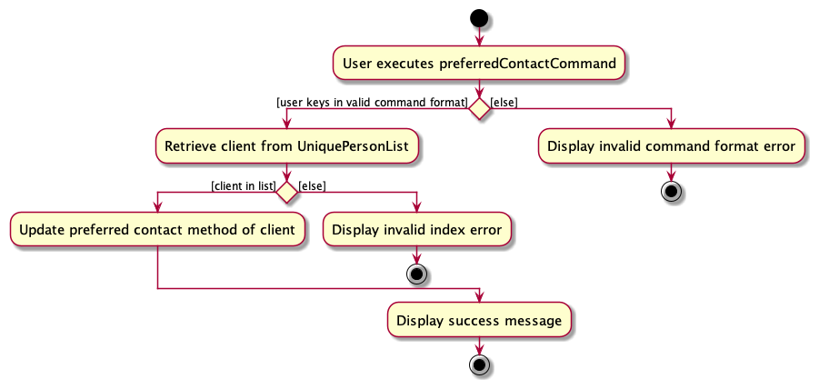

The following sequence diagram shows how the Preferred Contact operation works:
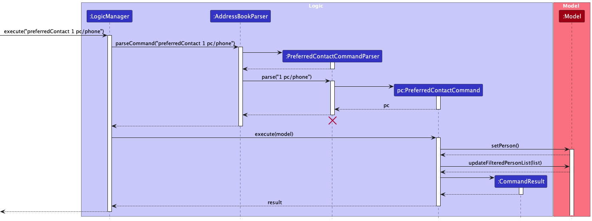

### AddTag feature

#### Current Implementation

The AddTag feature allows users to add tags under a certain client by indexing the client.

Given below is an example usage scenario and how the AddTag mechanism behaves at each step

1. The user launches the application and wants to delete a tag for `Alex Yeoh` who is the first client listed in InsuraHub
2. The user wants to add the tag `friend` to the client `Alex Yeoh` by entering the command `addTag 1 t/friend`
3. The `execute` method of the command will then be used to create a `CommandResult` object
4. This calls the `createPersonWithAddedTag` method which creates a new client with the same details as `Alex Yeoh` but with the newly added tag
5. The `model` calls the `setPerson` method and updates the targetted client with the newly created client from the previous step
6. The `CommandResult` is then returned by the `execute` method and the UI will display the updated list of clients with `Alex Yeoh` having the newly added tag and a success message is displayed on the UI

The following activity diagram shows how the AddTag operation works:

The following sequence diagram shows how the AddTag operation works:
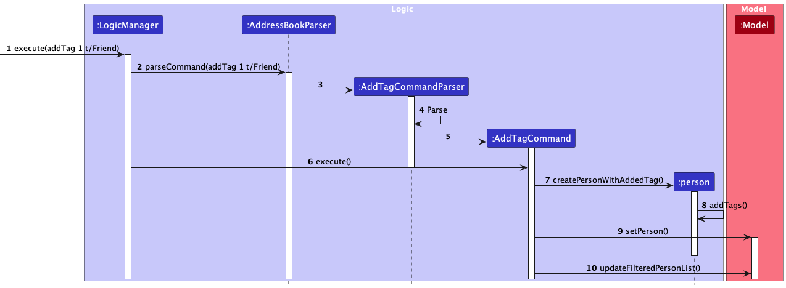

### DeleteTag feature

#### Current Implementation

The DeleteTag feature allows users to delete tags under a certain client by indexing the client.

Given below is an example usage scenario and how the DeleteTag mechanism behaves at each step

1. The user launches the application and wants to delete a tag for `Alex Yeoh` who is the first person in the InsuraHub
2. The user tries to delete tag with command `DeleteTag 1 t/friends`
3. InsuraHub displays an error message `Tags provided do not exist. Please provide an existing tag.`
4. Realising that the tag he wants to delete is `friend`, the user tries to type `DeleteTag 1 t/friend` instead
5. The result of the execution of the command will then be used to create a `CommandResult` object
6. This will then be passed to `Logic`
7. Upon confirmation that the tag exist in the first client of the address book, in this case `Alex Yeoh`, the tag is deleted from the UI of `Alex Yeoh` client
8. A successful message is returned, in this case `Deleted tags successfully for person Alex Yeoh; Phone: 87438807; Email: alexyeoh@example.com; Address: Blk 30 Geylang Street 29, #06-40; Tags: `

The following activity diagram shows how the DeleteTag operation works:
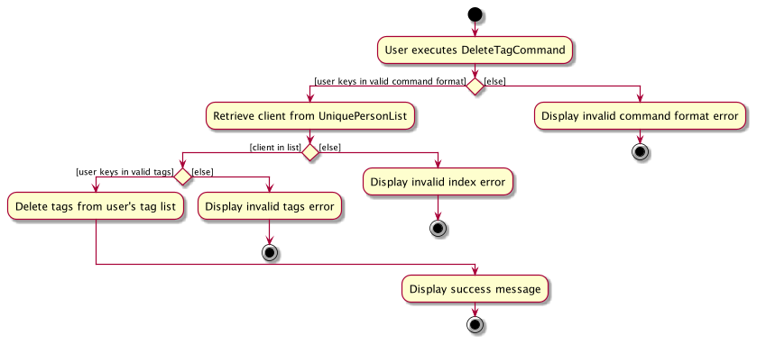

The following sequence diagram shows how the DeleteTag operation works:

### Filtering by Tag feature

#### Implementation

The proposed tag filtering mechanism is facilitated by `FilterCommandParser`, `FilterCommand`, and `FilterTagPredicate`.
The `FilterContainsKeywordsPredicate` implements the `Predicate<Person>`class which implements the test operation:

- `test(Person)` - Checks through the `Set<Tag>` of the Person passed to the method for the target tag being filtered.

The `FilterCommandParser` created by the `AddressBookParser` parses any `filter` command to create
a `FilterCommand` object which calls its `execute` method and the `updateFilteredPersonsList` method of the Model is
called with the `FilterContainsKeywordsPredicate` object as its parameter.

Given below is an example usage scenario and how the tag filtering mechanism behaves at each step.

1. The user launches the application. The current `filteredPersonList` is simply a list of all Person objects
   in the `AddressBook`.

2. The user executes `filter t/Friend` command to filter for all Person objects in the address book
   with the tag `Friend'`. The `filter` command calls the `ParseCommand` method of the `AddressBookParser` which
   returns a `FilterCommandParser` object.

3. The `FilterCommandParser` object then calls its `parse` method, returning a `FilterCommand` object
   which is executed by the `LogicManager`, calling the `updateFilteredPersonList` method of the `Model`.

4. The update list of filtered `Person` objects are then displayed on the ui.

The following activity diagram shows how the filter tag operation works:
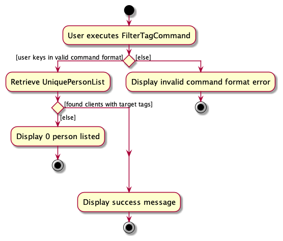

The following sequence diagram shows how the filter tag operation works:
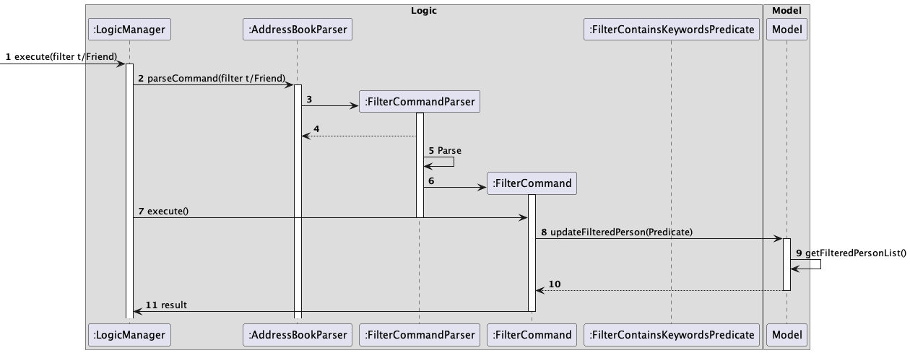

### File feature

#### Current Implementation

InsuraHub allow users to open a folder unique to each client to store their files
using their index relative to the current list shown in InsuraHub

these folders are stored in a main folder called ClientFiles in the main directory of InsuraHub

Given below is an example usage scenario and how the file mechanism behaves at each step

1. The user launches the application and wants to file certain documents for a client, `Alex Yeoh`, who is already stored in the application shown as the first person on InsuraHub.
2. The user tries to open a folder for the client with command `file 1`
3. InsuraHub will fetch the 1st client currently shown, if the index 1 is not out of bound in the list.
4. If the index is valid, the `Name` of the client and the `hashCode` will be concatenated to get a unique folder name for the client.
5. If the folder with the unique folder name does not exist then the folder will be created and placed in the ClientFiles folder.
6. The folder in the ClientFiles folder with the unique folder name will be opened.
7. The execution will then be over as the user can now drop files for the client into this opened folder, file command successful message will be displayed.

Activity diagram for file Command:
<puml src="diagrams/FileActivityDiagram.puml" width="450" />

### GroupMeeting feature

#### Current Implementation

InsuraHub allow users to filter based on the client preferred meeting region

There are only 5 preferred meeting regions:

1. north
2. south
3. east
4. west
5. central

Given below is an example usage scenario and how the Group Meeting mechanism behaves at each step

1. The user launches the application and wants to group all clients who prefer to meet in the west as he/she is planning to meet clients who live in the west.
2. The user tries to filter clients using `groupmeeting`.
3. InsuraHub displays a error message stating `"At least one region must be included"`.
4. The user then tries to filter clients using `groupmeeting west`.
5. `GroupMeetingCommandParser` and `AddressBookParser` will check if the command format provided is valid before `GroupMeetingCommand#execute()` is called.
6. InsuraHub will check if users in the list fulfills the `GroupMeetingContainsKeywordPredicate`
7. The result of the execution of the command will then be used to create a `CommandResult` object.
8. This object will then be passed to `Logic`.
9. The execution will then be over as the updated list of filtered `Person` objects are displayed on the Ui

Activity diagram for filtering clients based on preferred meeting region

Sequence diagram for filtering clients based on preferred meeting region

### Add Policy feature

#### Current implementation

InsuraHub allows users to add insurance policies to keep track of new policies that clients have purchased through them

There are 5 attributes for each policy:

1. Policy Name (pn)
2. Policy Description (pd)
3. Policy Value (pv)
4. Policy Start Date (psd)
5. Policy End Date (ped)

Given below is an example usage scenario and how the Add Policy Mechanism works:

1. The user launches the application and wants to add a policy for `Alex Yeoh` who is the first client listed in InsuraHub
2. The user wants to add a policy with `policyName: Health Insurance`, `policyDescription: Cancer Plan`, `policyValue: 2000.00`, `policyStartDate: 2023-01-01`, `policyEndDate: 2024-12-12`
3. The user enters the command `addPolicy 1 pn/Health Insurance pd/Cancer Plan pv/2000.00 psd/2023-01-01 ped/2024-12-12`
4. The `execute` method of the `AddPolicyCommand` will be called
5. This calls the `createPersonWithAddedPolicy` method, creating a new Person object with the same details as `Alex Yeoh` but with the newly added policy
6. The `model` calls the `setPerson` method and updates the targetted client with the newly created client from the previous step
7. The `CommanResult` is then returned by the `execute` method and the UI will display the updated list of clients with `Alex Yeoh` having the newly added policy and a success message is displayed on the UI
   
The following activity diagram shows how the AddPolicy operation works:
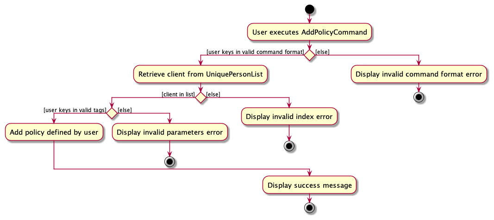

The following sequence diagram shows how the AddPolicy operation works:
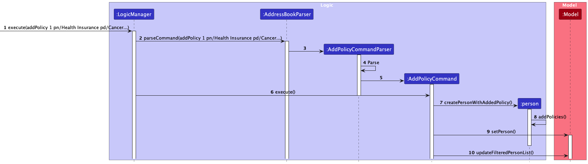

### Remove Policy feature

#### Current Implementation

The Remove Policy feature allows users to remove policies under a certain client by indexing the client and indexing the policy to be deleted

Given below is an example usage scenario and how the Remove Policy mechanism behaves at each step

1. The user launches the application and wants to remove a policy from `Alex Yeoh` who is the first client listed in the InsuraHub UI
2. The user wants to remove the first (right-most) policy of `Alex Yeoh` with command `removePolicy 1 1`
3. The `execute` method of the `RemovePolicyCommand` object will be called
4. That will then call the `removePolicy` method on the existing Person object identified by the indexes
5. The model will then call the `setPerson` method and updates the targetted client with the policy removed from the previous step
6. The `CommandResult` is then returned by the `execute` method and the UI will display the updated list of clients with `Alex Yeoh` not having the policy that was removed and a success message is displayed on the UI

The following activity diagram shows how the RemovePolicy operation works:
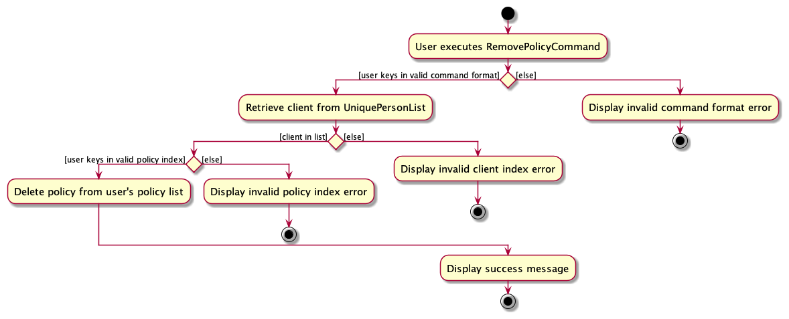

The following sequence diagram shows how the RemovePolicy operation works:
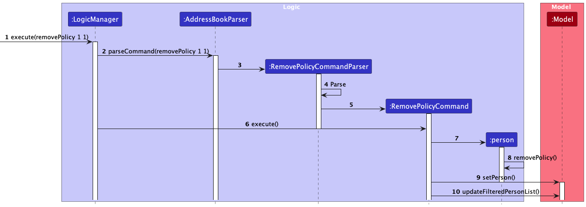
### View Policy Feature

#### Current Implementation

The View Policy feature allows users to view the details of policies under a certain client by indexing the client and the policy

Given below is an example usage scenario and how the View Policy mechanism behaves at each step

1. The user launches the application and wants to view the policies of `Alex Yeoh` who is the first client listed in the InsuraHub UI
2. The user wants to view the first (right-most) policy of the client `Alex Yeoh` by entering the command `viewPolicy 1 1`
3. The `execute` method of the `ViewPolicyCommand` will then be used to create a `CommandResult` object
4. This converts the `policyList` from a `Set` to a `List` and uses a `stream` to index the target policy to be removed
5. The `CommandResult` is then returned by the `execute` method with the `toString()` of the `policy` indexed from the previous step
6. The UI will display the details of the policy specified by the index and a success message is displayed on the UI

The following activity diagram for viewing policy of a particular Client:
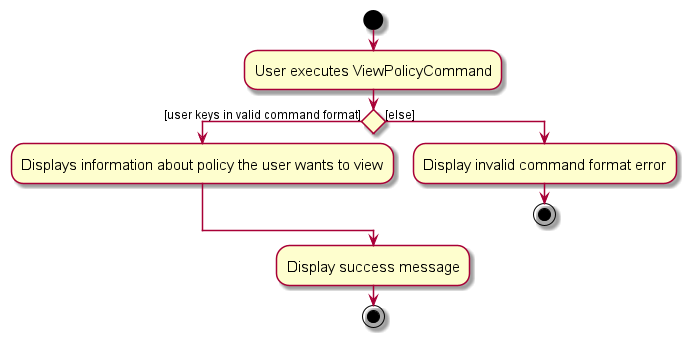

The following sequence diagram shows how the View Policy operation works:
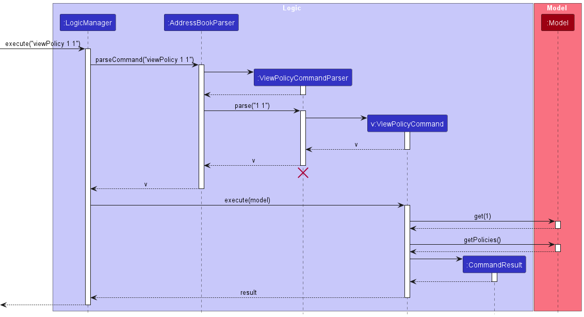

### Filter Policy Description feature

#### Current Implementation

InsuraHub allow users to filter clients based on their policy details, currently only filtering policy description

Given below is an example usage scenario and how the Filter Policy mechanism behaves at each step

1. The user launches the application and wants to filter clients who have Cancer Plans
2. The user tries to filter clients using `filterpolicydescription`.
3. InsuraHub displays a error message stating `"Invalid Command format"` with examples of how to use the command.
4. The user then tries to filter clients using `filterpolicydescription Cancer Plan`.
5. `FilterPolicyDescriptionCommandParser` and `AddressBookParser` will check if the command format provided is valid before `FilterPolicyDescriptionCommand#execute()` is called.
6. InsuraHub will check if users in the list fulfills the `FilterPolicyDescriptionPredicate`
7. The result of the execution of the command will then be used to create a `CommandResult` object.
8. This object will then be passed to `Logic`.
9. The execution will then be over as the updated list of filtered `Person` objects are displayed on the Ui

The following activity diagram shows how the Filter Policy Description operation works:
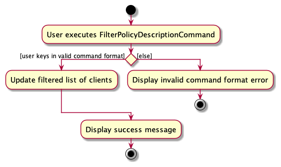

### Toggle Mode feature

#### Current Implementation

InsuraHub allows users to toggle between a dark(default) or light mode to their preference to maximise their productivity

Given below is an example usage scenario and how the Toggle Mode mechanism behaves at each step

1. The user launches the application in the default dark mode and wants to toggle it to light mode and enters the command `toggleMode`
2. The `execute` method of the `ToggleModeCommand` is called
3. The `uiModeManager` calls its `getUiMode` method and stores the current `uiMode` in a string
4. The `uiMode` is detected to be the default value of `MainWindow.fxml` and is updated to `LightWindow.fxml`
5. The `CommandResult` is returned by the `execute` method and the mode of the UI will be switched to Light Mode on the user's next start up of the application
6. The UI will continue displaying the list of clients and a success message is displayed on the UI

The following sequence diagram shows how the Toggle Mode operation works:

### Change Password feature

#### Current Implementation

InsuraHub allows users to change the required password to enter InsuraHub

Given below is an example usage scenario and how the changePassword command behaves

1. The user launches the application and sets the password as "oldPW1" before entering InsuraHub with the password.
2. The user wants to change the password and enters the commant `changePassword op/oldPW1 np/newPW2`
3. The `passwordManager` calls its `check` method on the old password given "oldPW1" to determine if the current password saved in encoded.txt in the data folder is indeed "oldPW1"
3. The `passwordManager` detects that the old password is indeed correct and calls its `set` method to set the new password as "newPW2" by modifying the string saved in encoded.txt in the data folder.
5. The UI will continue displaying the list of clients and a success message is displayed on the UI.

activity diagram for changePassword Command:
<puml src="diagrams/changePasswordActivityDiagram.puml" width="450" />

The following sequence diagram shows how the changePassword operation works:
<puml src="diagrams/changePasswordSequenceDiagram.puml" width="450" />

### \[Proposed\] Undo/redo feature

#### Proposed Implementation

The proposed undo/redo mechanism is facilitated by `VersionedAddressBook`. It extends `AddressBook` with an undo/redo history, stored internally as an `addressBookStateList` and `currentStatePointer`. Additionally, it implements the following operations:

- `VersionedAddressBook#commit()` — Saves the current address book state in its history.
- `VersionedAddressBook#undo()` — Restores the previous address book state from its history.
- `VersionedAddressBook#redo()` — Restores a previously undone address book state from its history.

These operations are exposed in the `Model` interface as `Model#commitAddressBook()`, `Model#undoAddressBook()` and `Model#redoAddressBook()` respectively.

Given below is an example usage scenario and how the undo/redo mechanism behaves at each step.

Step 1. The user launches the application for the first time. The `VersionedAddressBook` will be initialized with the initial address book state, and the `currentStatePointer` pointing to that single address book state.

<puml src="diagrams/UndoRedoState0.puml" alt="UndoRedoState0" />

Step 2. The user executes `delete 5` command to delete the 5th person in the address book. The `delete` command calls `Model#commitAddressBook()`, causing the modified state of the address book after the `delete 5` command executes to be saved in the `addressBookStateList`, and the `currentStatePointer` is shifted to the newly inserted address book state.

<puml src="diagrams/UndoRedoState1.puml" alt="UndoRedoState1" />

Step 3. The user executes `add n/David …​` to add a new person. The `add` command also calls `Model#commitAddressBook()`, causing another modified address book state to be saved into the `addressBookStateList`.

<puml src="diagrams/UndoRedoState2.puml" alt="UndoRedoState2" />

<box type="info" seamless>

**Note:** If a command fails its execution, it will not call `Model#commitAddressBook()`, so the address book state will not be saved into the `addressBookStateList`.

</box>

Step 4. The user now decides that adding the person was a mistake, and decides to undo that action by executing the `undo` command. The `undo` command will call `Model#undoAddressBook()`, which will shift the `currentStatePointer` once to the left, pointing it to the previous address book state, and restores the address book to that state.

<puml src="diagrams/UndoRedoState3.puml" alt="UndoRedoState3" />

<box type="info" seamless>

**Note:** If the `currentStatePointer` is at index 0, pointing to the initial AddressBook state, then there are no previous AddressBook states to restore. The `undo` command uses `Model#canUndoAddressBook()` to check if this is the case. If so, it will return an error to the user rather
than attempting to perform the undo.

</box>

The following sequence diagram shows how the undo operation works:

<puml src="diagrams/UndoSequenceDiagram.puml" alt="UndoSequenceDiagram" />

<box type="info" seamless>

**Note:** The lifeline for `UndoCommand` should end at the destroy marker (X) but due to a limitation of PlantUML, the lifeline reaches the end of diagram.

</box>

The `redo` command does the opposite — it calls `Model#redoAddressBook()`, which shifts the `currentStatePointer` once to the right, pointing to the previously undone state, and restores the address book to that state.

<box type="info" seamless>

**Note:** If the `currentStatePointer` is at index `addressBookStateList.size() - 1`, pointing to the latest address book state, then there are no undone AddressBook states to restore. The `redo` command uses `Model#canRedoAddressBook()` to check if this is the case. If so, it will return an error to the user rather than attempting to perform the redo.

</box>

Step 5. The user then decides to execute the command `list`. Commands that do not modify the address book, such as `list`, will usually not call `Model#commitAddressBook()`, `Model#undoAddressBook()` or `Model#redoAddressBook()`. Thus, the `addressBookStateList` remains unchanged.

<puml src="diagrams/UndoRedoState4.puml" alt="UndoRedoState4" />

Step 6. The user executes `clear`, which calls `Model#commitAddressBook()`. Since the `currentStatePointer` is not pointing at the end of the `addressBookStateList`, all address book states after the `currentStatePointer` will be purged. Reason: It no longer makes sense to redo the `add n/David …​` command. This is the behavior that most modern desktop applications follow.

<puml src="diagrams/UndoRedoState5.puml" alt="UndoRedoState5" />

The following activity diagram summarizes what happens when a user executes a new command:

<puml src="diagrams/CommitActivityDiagram.puml" width="250" />

#### Design considerations:

**Aspect: How undo & redo executes:**

- **Alternative 1 (current choice):** Saves the entire address book.

  - Pros: Easy to implement.
  - Cons: May have performance issues in terms of memory usage.

- **Alternative 2:** Individual command knows how to undo/redo by
  itself.
  - Pros: Will use less memory (e.g. for `delete`, just save the person being deleted).
  - Cons: We must ensure that the implementation of each individual command are correct.

_{more aspects and alternatives to be added}_

### \[Proposed\] Data archiving

_{Explain here how the data archiving feature will be implemented}_

### \[Proposed\] Undo/redo feature

---

## **Documentation, logging, testing, configuration, dev-ops**

- [Documentation guide](Documentation.md)
- [Testing guide](Testing.md)
- [Logging guide](Logging.md)
- [Configuration guide](Configuration.md)
- [DevOps guide](DevOps.md)

Return to [Table Of Contents](#table-of-contents)

---

## **Acknowledgements**

This project is based on the AddressBook-Level3 project created by the [SE-EDU initiative](https://se-education.org).

Return to [Table Of Contents](#table-of-contents)

## **Appendix: Requirements**

### Product scope

**Target user profile**:

- has a need to manage a significant number of client's contacts
- prefer desktop apps over other types
- can type fast
- prefers typing to mouse interactions
- is reasonably comfortable using CLI apps
- has a need to be able to easily find different clients contacts
- remembers some of their client's only by their firstname,lastname,nickname or initials
- needs to handle a large amount of documents that are stored for different clients

**Value proposition**: manage client's contacts faster than a typical mouse/GUI driven app while providing ways to efficiently find/store specific client and their documents

### User stories

Priorities: High (must have) - `* * *`, Medium (nice to have) - `* *`, Low (unlikely to have) - `*`

| Priority | As a …​                                    | I want to …​                                                       | So that I can…​                                                          |
| -------- | ------------------------------------------ | ------------------------------------------------------------------ | ------------------------------------------------------------------------ |
| `* * *`  | new user                                   | see usage instructions                                             | refer to instructions when I forget how to use the App                   |
| `* * *`  | user                                       | add a new person                                                   |                                                                          |
| `* * *`  | user                                       | delete a person                                                    | remove entries that I no longer need                                     |
| `* * *`  | user                                       | find a person by name                                              | locate details of persons without having to go through the entire list   |
| `* *`    | user                                       | hide private contact details                                       | minimize chance of someone else seeing them by accident                  |
| `*`      | user with many persons in the address book | sort persons by name                                               | locate a person easily                                                   |
| `* * *`  | insurance agent                            | Add more tags to my clients                                        | easily find them later                                                   |
| `* * *`  | insurance agent with multiple documents    | Store documents along with client contact information              | in an orderly manner                                                     |
| `* * *`  | insurance agent                            | Highlight the preferred contact details of my clients              | quickly contact them for any matters                                     |
| `* * *`  | insurance agent using the CLI              | Input and update client information through text commands          | provide personalized and efficient service without a graphical interface |
| `* * *`  | insurance agent                            | Filter interested clients                                          | focus my time on providing value to their lives                          |
| `* *`    | insurance agent                            | Organize my clients’ records based on tags                         | filter for specific groups of clients                                    |
| `* *`    | insurance agent                            | Cluster my clients into areas they want to meet                    | set up meetings that minimize my travel time                             |
| `* *`    | busy insurance agent                       | Load client data quickly                                           | use the app even with high traffic and not waste time waiting            |
| `* *`    | insurance agent                            | Sort client priorities                                             | attend to their needs first                                              |
| `* *`    | insurance agent prioritizing data security | Create secure log-in passwords and authentication                  | protect client data integrity                                            |
| `* *`    | non-technical insurance agent              | Access comprehensive help documentation or a built-in help command | understand available commands, their syntax, and purpose in CLI          |
| `* *`    | forgetful insurance agent                  | Have important todos in the homepage                               | not forget to do them, such as client meetings and applying for claims   |
| `* *`    | life insurance agent                       | Easily filter clients with policy updates                          | inform them more timely on the updates                                   |
| `* *`    | insurance agent                            | Track progress of insurance claims through text-based commands     | provide timely updates and ensure a smooth claims process via CLI        |
| `* *`    | insurance agent                            | Receive alerts for expiring insurance policies                     | prioritize meeting clients with expiring policies                        |
| `*`      | insurance agent with traditional clients   | Export a client’s policy summary to a spreadsheet                  | print it out for clients                                                 |
| `*`      | artistic insurance agent                   | Customize the UI                                                   | feel better using a more unique UI                                       |
| `*`      | insurance agent                            | Create new insurance policies for my clients                       | accommodate changes or updates requested by clients                      |
| `*`      | insurance agent working with others        | Send and receive client details with other users                   | take over/hand over clients from other agents                            |
| `*`      | data-driven insurance agent                | Access a variety of reports and analytics                          | make informed decisions to improve my business                           |

_{More to be added}_

Return to [Table Of Contents](#table-of-contents)

### Use cases

If not explicitly mentioned, the actor will be a Financial Advisor and InsuraHub as the System.

**Use Case 1** - Adding more tags to client records. 
Precondition: User knows the client index relative to the list and the client is added into the list of clients

MSS:

1. User keys in all tags that is tied to the particular client
2. Systems displays the tags that have been added to the particular client 
   Use case ends

**Extensions:**

1a. User did not add a tag 
1a1. System displays an error message indicating that user have to key in at least one tag 
Use case ends

**Use Case 2** - Deleting tags from client records. 
Precondition: User knows the client index relative to the list and the client is added into the list of clients, clients must also have the tag/tags listed in one of their tags.

MSS:

1. User keys in tags that he/she want to be removed from the client tags
2. Systems returns a new client without the tags that the user wants removed. 
   Use case ends

**Extensions:**

1a. User keys in a tag that is not in the tags that the client originally have. 
1a1. System returns an error message stating that the tag is not present and that he/she needs to give a tag that is in the client list of tags. 
Use case ends.

1b. User did not provide any tag to be removed 
1b1. System returns an error message stating that one tag must be provided. 
Use case ends

**Use Case 3** - Adding client preferred form of contact 
Precondition: User knows the client index relative to the list and the client is added into the list of clients

MSS:

1. User adds in the clients preferred form of contact.
2. System updates with the preferred form of contact. 
   Use case ends

**Extensions**

1a. User adds in multiple forms of contacts 
1a1. System displays an error message to tell the user to select only one form of preferred contact and that the
process of selecting preferred form of contact have failed. 
Use case ends

1b. User adds in a invalid preferred form of contact. 
1b1. System displays an error message indicating that user can only put in a preferred form of contact with a valid form of contact. 
Use case ends

1c. User did not add in any preferred form of contact 
1c1. System displays an error message indicating that the user have to put in at least one form of contact. 
User case ends

**Use Case 4** - Filtering client information using tags

MSS:

1. User filters using tags.
2. System updates with a list of clients that fulfills the tags to be filtered. 
   Use case ends

**Use Case 5** - Storing client documents neatly in a folder 
Precondition: User knows the client index relative to the list and the client is added into the list of clients

MSS:

1. User keys in `file` followed by index 
2. System opens up the folder of the particular client with the relevant files inside the folder 
   Use case ends

**Extensions**

1a. User keys in invalid index 
1a1. System displays an error message indicating that the process of creating a file for the user is stopped. 
Use case ends

**Use Case 6** - Grouping clients based on the nearest MRT station from their residence to a region

MSS:

1. User provides a region to be filtered
2. System returns a list of clients who live in a particular region. 
   Use case ends.

**Extensions:**

1a. User keys in an invalid region 
1a1. System returns an error message stating to put in a valid region to be filtered. 
Use Case Ends

**Use case 7** - Delete a person

MSS:

1.  User requests to delete a specific person in the list
2.  InsuraHub deletes the person 
    Use case ends.

**Extensions**

- 1a. The given index is invalid.

  - 1a1. InsuraHub shows an error message. 
    Use case resumes at step 2.

**Use case 8** - Filter Policy

MSS:

1.  User request to filter based on policy description
2.  InsuraHub show the list of people who have the policy 
    Use case ends.

**Extensions**

- 2a. The list is empty. 
  Use case ends.

_{More to be added}_

Return to [Table Of Contents](#table-of-contents)

### Non-Functional Requirements

1.  The application should be compatible with mainstream operating systems such as Windows, Linux, Unix, and macOS, as long as they have Java 11 or above installed.
2.  Should be able to hold up to 1000 persons without a noticeable sluggishness in performance for typical usage.
3.  A user with above average typing speed for regular English text (i.e. not code, not system admin commands) should be able to accomplish most of the tasks faster using commands than using the mouse.
4.  The application should ensure the integrity and consistency of data stored in the address book. Data should not be lost or corrupted during normal usage or unexpected errors.
5.  Any commands should be executed within 1s.
6.  The address book should be able to store 2000 clients' information.

_{More to be added}_

_{More to be added}_

Return to [Table Of Contents](#table-of-contents)

### Glossary

- **Mainstream OS**: Windows, Linux, Unix, OS-X
- **Private contact detail**: A contact detail that is not meant to be shared with others
- **Tag**: A tag object assigned to a client that is a categorical description of the client
- **Client Priorities**: Priority of the client that the insurance agent has to attend to, where each priority is its own tag
- **Usage Instructions**: A quickstart guide with a short list of basic commands for users' reference within the App.

Return to [Table Of Contents](#table-of-contents)

---

## **Appendix: Instructions for manual testing**

Given below are instructions to test the app manually.

<box type="info" seamless>

**Note:** These instructions only provide a starting point for testers to work on;
testers are expected to do more _exploratory_ testing.

</box>

### Launch and shutdown

1. Initial launch

   1. Download the jar file and copy into an empty folder

   1. Double-click the jar file Expected: Shows the GUI with a set of sample clients. The window size may not be optimum.

1. Saving window preferences

   1. Resize the window to an optimum size. Move the window to a different location. Close the window.

   1. Re-launch the app by double-clicking the jar file. 
      Expected: The most recent window size and location is retained.

1. _{ more test cases …​ }_

### Deleting a person

1. Deleting a person while all persons are being shown

   1. Prerequisites: List all persons using the `list` command. Multiple persons in the list.

   1. Test case: `delete 1` 
      Expected: First client is deleted from the list. Details of the deleted client shown in the status message. Timestamp in the status bar is updated.

   1. Test case: `delete 0` 
      Expected: No person is deleted. Error details shown in the status message. Status bar remains the same.

   1. Other incorrect delete commands to try: `delete`, `delete x`, `...` (where x is larger than the list size) 
      Expected: Similar to previous.

1. _{ more test cases …​ }_

### Saving data

1. Dealing with missing/corrupted data files

   1. _{explain how to simulate a missing/corrupted file, and the expected behavior}_

1. _{ more test cases …​ }_

## **Appendix: Planned Enhancements**

### Add Feature - Email Validation

#### Current State

The `email` parameter for adding a new client to InsuraHub currently only allows alphanumeric characters in the local-part for email addresses in the format local-part@domain.com

#### Planned Enhancement

The local-part will allow special characters which are commonly used in email addresses with the limitation of having no consecutive special characters together

### Add Feature - Phone Number Validation

#### Current State

The `phone number` parameter for adding a new client to InsuraHub currently does not check for if the phone number is a typical valid Singaporean phone number that begins with 6, 8, or 9

#### Planned Enhancement

The `phone number` will be checked to ensure it starts with 6, 8, or 9, with an error message thrown if it fails that check

### Add Policy Feature - Invalid parameter and prefix name

#### Current State

No errors for Invalid prefixes:

- Having 2 `pn` prefixes (policy name) does not return the user any error in the InsuraHub UI
- No error message on the UI for empty parameters such as an empty policy name `pn`
- The `policy description` should be of the prefix `pd` in the `addPolicy` command but using an unknown `pr` prefix that precedes the policy description does not throw any error
  Invalid dates such as `2023-02-29` do not currently return errors in the UI

##### Planned Enhancement

- The prefixes will be checked to ensure that the `addPolicy` command entered by the user is a valid command with the correct prefixes
- The `policy start date` and `policy end date` will be checked to ensure that they are valid dates, including edge cases such as leap years

### Add Policy Feature - Special characters allowed

#### Current State

The Add Policy command currently allows for special characters such as `;;` which is not how policies would be named

#### Planned Enhancement

Policy name and description will be checked through for special characters and corresponding error messages will be returned in the UI

### Remove Policy Feature - Success message incorrectly formatted

#### Current State

The success message is currently not formatted properly with the details of the client wrapped in braces preceded by `seedu.address.model…​.`

#### Planned Enhancement

The success message will be formatted properly

### Preferred Contact Feature - Parameters must be lowercase

#### Current state

The Preferred Contact command only accepts parameters in lower-case but there is no warning when the user enters a parameter in uppercase

#### Planned Enhancement

There will be error message returned in the UI when the user enters the parameters not in lowercase (either `email` or `phone`)

Return to [Table Of Contents](#table-of-contents)
