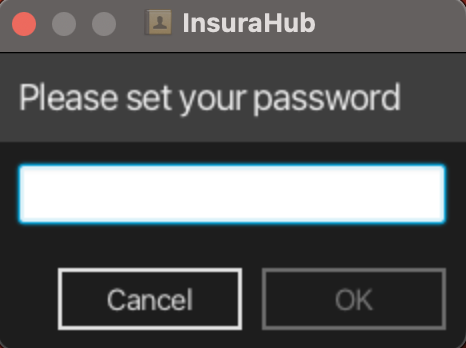

# Insurahub User Guide

Insurahub is a **desktop app for managing clients, optimized for use via a Command Line Interface** (CLI) while still having the benefits of a Graphical User Interface (GUI). If you can type fast, Insurahub can get your contact management tasks done faster than traditional GUI apps. This app is mainly used by insurance agents who have many clients and tasks such as appointments to keep track of on a daily basis.

<!-- * Table of Contents -->
<page-nav-print />

---

## Quick start

1. Ensure you have Java `11` or above installed in your Computer.

2. Download the latest `insurahub.jar` from [here](https://github.com//AY2324S1-CS2103-W14-1/tp).

3. Copy the file to the folder you want to use as the _home folder_ for your App.

4. Open a command terminal, `cd` into the folder you put the jar file in, and use the `java -jar insurahub.jar` command to run the application. 
   A GUI similar to the below should appear in a few seconds. Note that if a password had been previously set, then this step would be skipped. If you are setting the password, do record the password as if you forget the password before entering the app to change the password, you have to retrieve it by going to data/encoded.txt.

   

5. After the password has been set, A GUI similar to the previous one should ask the user to enter the password that they set.

6. After the password is entered A GUI similar to the below should appear in a few seconds.
   

7. Type the command in the command box and press Enter to execute it. e.g. typing **`help`** and pressing Enter will open the help window. 
   Some example commands you can try:

   - `list` : Lists everyone in InsuraHub.

   - `add n/John Doe p/98765432 e/johnd@example.com a/311, Clementi Ave 2, #02-25 t/friends pmr/west` : Adds a Person named `John Doe` to the application.
   - `addTag 1 t/classmate` : Adds a "classmate" tag to the first user in the address book.

   - `delete 3` : Deletes the 3rd person shown in the current list.

   - `deleteTag 1 t/classmate` : Deletes the "classmate" tag from the first user in the address book if the "classmate" tag currently exists
   - `clear` : Deletes everyone from InsuraHub.
   - `filter t/friend`: Filters for all clients in the address book that contains the `friend' tag.

   - `exit` : Exits the app.

   - `file 1`: Creates a folder for the first person in the address book with the person's name as the name of the folder

   - `preferredContact 1 pc/phone` : Highlight to show that that is the main form of contact that the client in the first index prefers.

8. Refer to the [Features](#features) below for details of each command.

9. Do remember to only open the application once from one terminal to prevent issues such as updates not being done properly, updates on the first session will not result in the second session to be updated if they are being opened simultaneously.

10. Do read the known issues section before beginning to use the application.

---

## Features

<box type="info" seamless>

**Notes about the command format:** 

- Words in `UPPER_CASE` are the parameters to be supplied by the user. 
  e.g. in `add n/NAME`, `NAME` is a parameter which can be used as `add n/John Doe`.

- Items in square brackets are optional. 
  e.g `n/NAME [t/TAG]` can be used as `n/John Doe t/friend` or as `n/John Doe`.

- Items with `…`​ after them can be used multiple times including zero times. 
  e.g. `[t/TAG]…​` can be used as ` ` (i.e. 0 times), `t/friend`, `t/friend t/family` etc.

- Parameters can be in any order. 
  e.g. if the command specifies `n/NAME p/PHONE`, `p/PHONE n/NAME` is also acceptable.

- Extraneous parameters for commands that do not take in parameters (such as `help`, `list`, `exit` and `clear`) will be ignored. 
  e.g. if the command specifies `help 123`, it will be interpreted as `help`.

- If you are using a PDF version of this document, be careful when copying and pasting commands that span multiple lines as space characters surrounding line-breaks may be omitted when copied over to the application.

- `INDEX` maximum positive value is 2^31 - 1 which is 2147483647, larger values will not be accepted due to the limitation of integers in java.
  </box>

- Command word are case sensative, `help` and `HELP` are different and typing `HELP` will return an error that command does not exist.

### Viewing help : `help`

Shows a message explaning how to access the help page. 
Typing `help` will show `Opened help window` text from the application, clicking on the `Help` button will only show the help window and not show the text message.

Format: `help`

### Adding a new client: `add`

Adds a new person to the Insurahub App, the name of the Person must be unique, other parameters can be duplicated.

Format: `add n/NAME p/PHONE e/EMAIL a/ADDRESS [t/TAG]… pmr/PREFERRED_MEETING_REGION`

- `NAME` must be Unique in InsuraHub.
- `PHONE` must be 8 numbers long and start with either 6,8 or 9.
- `TAG` should be alphanumeric
- `EMAIL` Emails should be of the format local-part@domain and adhere to the following constraints:
  - The local-part should only contain alphanumeric characters and these special characters, excluding the parentheses
  - The local-part may not start or end with any special characters
  - This is followed by a '@' and then a domain name.
  - have each domain lebel to end with at least 2 characters
  - have each domain label start and end with alphanumeric characters
  - have each domain label consist of alphanumeric characters, separated only by hyphens, if any.
- `ADDRESS` Addresses can take any values, and it should not be blank"
- `PREFERRED_MEETING_REGION` have to be one of these strings west/north/south/east/central.

Examples:

- `add n/JohnnySnake p/91234567 e/johnnythesnake12@gmail.com a/Blk 69 Geylang Street 12, #12-69 pmr/east`
- `add n/BetsyCrowe p/92222222 e/betsycrowe@example.com a/Newgate Prison t/friends pmr/north`

### Listing all clients : `list`

Shows a list of all clients in the address book.

Format: `list`

### Editing a person : `edit`

Edits an existing person in the address book.

Format: `edit INDEX [n/NAME] [p/PHONE] [e/EMAIL] [a/ADDRESS] [t/TAG]… [pmr/_MEETING_REGION]`

- Edits the person at the specified `INDEX`. The index refers to the index number shown in the displayed person list. The index **must be a positive integer** 1, 2, 3, …​
- At least one of the optional fields must be provided.
- Existing values will be updated to the input values.
- When editing tags, the existing tags of the person will be removed i.e adding of tags is not cumulative
- Recommended to use addTag to add tags, deleteTag to delete tags
- You can remove all the person’s tags by typing `t/` without
  specifying any tags after it.

Examples:

- `edit 1 p/91234567 e/johndoe@example.com` Edits the phone number and email address of the 1st person to be `91234567` and `johndoe@example.com` respectively.
- `edit 2 n/Betsy Crower t/` Edits the name of the 2nd person to be `Betsy Crower` and clears all existing tags.

### Locating clients by name: `find`

Finds clients whose names contain any of the given keywords.

Format: `find KEYWORD [MORE_KEYWORDS]`

- The search is case-insensitive. e.g `hans` will match `Hans`
- The order of the keywords does not matter. e.g. `Hans Bo` will match `Bo Hans`
- Only the name is searched
- Only full words will be matched e.g. `Han` will not match `Hans`
- Clients matching at least one keyword will be returned (i.e. `OR` search).
  e.g. `Hans Bo` will return `Hans Gruber`, `Bo Yang`

Examples:

- `find John` returns `john` and `John Doe`
- `find alex david` returns `Alex Yeoh`, `David Li` 
  

### Deleting a person : `delete`

Deletes the specified person from the address book.

Format: `delete INDEX`

- Deletes the person at the specified `INDEX`.
- The index refers to the index number shown in the displayed person list.
- The index **must be a positive integer** 1, 2, 3, …​

Examples:

- `list` followed by `delete 2` deletes the 2nd person in the address book.
- `find Betsy` followed by `delete 1` deletes the 1st person in the results of the `find` command.

### Clearing all entries : `clear`

Clears all entries from Insurahub. Do note that so long as `clear` is contained in your commands, details in Insurahub will be deleted

Format: `clear`

### Filtering for Clients via tag : `filter`

Filters for all clients in InsuraHub that have the tag being filtered.

Format: `filter t/TAG1 t/TAG2`

- Filters for person objects that contain all the specified tags `TAG1`, `TAG2`.
- Only person objects that contain all the specified tags will be listed in the Ui.

Examples:

- `filter` followed by `t/FRIEND` will list out all the clients that have the `friend` tag.
- `filter` followed by `t/FRIEND t/COLLEAGUE` will list out all the clients that have both the `friend` and `colleague`
  tag. Clients that contain only one of either specified tags will not be shown.

### Adding a policy to a client : `addPolicy`

Adds an insurance policy to a client in InsuraHub.

Format: `addPolicy INDEX [pn/POLICY NAME]  [pd/POLICY DESCRIPTION]  [pv/POLICY VALUE]  [psd/POLICY START DATE]  [ped/POLICY END DATE]`

- `INDEX` must be a positive integer less than or equals to the number of clients currently shown on InsuraHub.

- `POLICY VALUE` have a limit of up to 7 digits, anything larger will not be accepted.

Examples:

- `addPolicy 1 pn/Health Insurance pd/Cancer Plan pv/2000.00 psd/2023-01-01 ped/2024-12-12 `
  will add a policy with name Health Insurance and other details such as start date 2023-01-01 to the
  first client currently listed on the InsuraHub Ui.

### Removing a policy from a client : `removePolicy`

Removes an existing insurance policy from a client currently listed on the Ui of InsuraHub.

Format: `removePolicy INDEX_1 INDEX_2`

- `INDEX_1` must be a positive integer less than or equals to the number of clients currently shown on InsuraHub.
- `INDEX_2` must be a positive integer less than or equals to the number of policies the client specified by `INDEX_1` has.

Examples:

- `removePolicy 1 1` will remove the first policy (right-most) of the first client currently listed in the InsuraHub Ui.

### Viewing policy of a client: `viewPolicy`

Creates/opens up a folder specific to a client for storing of their documents

Format 1: `viewPolicy INDEX_1 INDEX_2`

- `INDEX_1` must be a positive integer less than or equals to the number of clients currently shown on InsuraHub.
- `INDEX_2` must be a positive integer less than or equals to the number of policies the client specified by `INDEX_1` has.

Examples:

- `viewPolicy 1 1` will display the first policy (right-most) of the first client currently listed in the InsuraHub Ui.

### Adding a client preferred contact: `preferredContact`

Highlight the specific contact details of the particular client from the application.

Format 1: `preferredContact INDEX pc/PREFERRED_CONTACT`

- **INDEX** must be a positive integer less than or equals to the number of clients currently shown on Insurahub.
- **preferred contact method** either phone number or email
- Preferred contact method:
  - phone number
  - email
- Preferred contact parameter has to be in lowercase.
- To remove the preferred contact of the client is `preferredContact INDEX pc/`

Examples:

- `preferredContact 1 pc/phone` will highlight the phone number of the first person in the current list shown
- `preferredContact 1 pc/email` will highlight the email address of the first person in the current list shown
- `preferredContact 1 pc/` will either unhighlight the phone number or email address of the first person in the current list shown if it is highlighted or return the first person in the current list with no changes made.

### Exiting the program : `exit`

Exits the program.

Format: `exit`

### Saving the data

Insurahub data are saved in the hard disk automatically after any command that changes the data. There is no need to save manually.

### Editing the data file

Insurahub data are saved automatically as a JSON file `[JAR file location]/data/Insurahub.json`. Advanced users are welcome to update data directly by editing that data file.

<box type="warning" seamless>

**Caution:**
If your changes to the data file makes its format invalid, Insurahub will discard all data and start with an empty data file at the next run. Hence, it is recommended to take a backup of the file before editing it.
</box>

### Adding tags to a client object: `addTag`

Adds at least one new tags to a client object without deleting the pre-exisiting tags.

Format 1: `addTag INDEX t/TAG_1 t/TAG_2`

- Number of tags in the format is just an example.

- **INDEX** must be a positive integer less than or equals to the number of clients currently shown on Insurahub.

Examples:

- `addTag 1 t/friend` will add the tag 'friend' to the first client on the current list.

### Deleting tags from a client object: `deleteTag`

Removes at least one pre-existing tags from a client object.

Format 1: `deleteTag INDEX t/TAG_1 t/TAG_2` 

- Number of tags in the format is just an example.

- **INDEX** must be a positive integer less than or equals to the number of clients currently shown on Insurahub.
- **tag**: must be a valid tag in the pre-defined list implemented in the app

Examples:

- `deleteTag 1 t/friend` will remove the tag 'friend' from the first client on the current list.

### Storing documents of a client: `file`

Creates/opens up a folder specific to a client's name for storing of their documents. When it is first created, it will be empty. We can add client's documents into the file and it will be saved in the file after closing the window.

Format 1: `file INDEX`

- **INDEX** must be a positive integer less than or equals to the number of clients currently shown on Insurahub.

Examples:

- `file 1` will open up a folder that is named after the name of the first client currently on the list

### Grouping client preferred meeting locations: `groupmeeting`

Groups clients based on their preferred meeting locations, only list one of west, north, south, east or central per command.

Format: `groupmeeting west/north/south/east/central`

Examples:

- `groupmeeting west` will group all clients that prefer to meet in the west region and returns a list of clients that prefer to meet in the west region

### Change password: `changePassword`

Changes the required password to enter Insurahub.

Format: `changePassword op/OLDPASSWORD np/NEWPASSWORD`

- `OLDPASSWORD` must be the password string that was previously set
- `NEWPASSWORD` can be any string of length >= 1

Examples:

- `changePassword op/boo123 np/pass456` if the previous password is boo123, then the new password is set as pass456.
- `changePassword op/bad123 np/pass456` if the previous password is not bad123, then the password is unchanged.

### Toggling the Ui appearance: `toggleMode`

Toggles between lightMode and DarkMode, the next time InsuraHub is opened the change will be shown.

Format: `toggleMode`

Examples:

- `toggleMode` will display the mode that Insurahub will be in when it is next opened. If it is lightmode, it will be changed to dark mode and vice versa

### Filter policy using policy description `filterpolicydescription`

- Filter policies using policy description, it is case sensative, hence if client have `Cancer Plan` typing `CANCER PLAN` will not work.
- Typing non string characters will not return an error, however it might be an issue as it is unlikely that policy description contains non string characters.
- If policy description is 123 and you filter 123, it will return the policy.

Format: `filterpolicydescription POLICYDESCRIPTION`

Examples:

- `filterpolicydescription Cancer Plan` will filter all the clients who have cancer plan and show the list of clients with them.

## FAQ

**Q**: How do I transfer my data to another Computer? 
**A**: Install the app in the other computer and overwrite the empty data file it creates with the file that contains the data of your previous Insurahub home folder.

---

## Known issues

1. **When using multiple screens** 
   If you move the application to a secondary screen, and later switch to using only the primary screen, the GUI will open off-screen. The remedy is to delete the `preferences.json` file created by the application before running the application again.

2. **When opening multiple application using multiple terminals** 
   If you do any actions on the first application, the updates will not be shown on the second application as currently we do not allow application to work simultaneously.

3. **Clients/Persons/Contacts** will generally be regarded as the same in insurahub even though it can be confusing

4. **Policy date issue** 
   Putting the end date earlier than the start date for policies is currently accepted, we have acknowledge the error and will work to improve the application to remove those errors.

5. **Client Files of deleted/edited clients are retained** 
   At this point the application is unable to delete the files of deleted clients or edit the files of edited clients, we can only delete, edit it manually.

---

## Command summary

| Action                        | Format, Examples                                                                                                                                                                                                            |
| ----------------------------- | --------------------------------------------------------------------------------------------------------------------------------------------------------------------------------------------------------------------------- |
| **Add**                       | `add n/NAME p/PHONE_NUMBER e/EMAIL a/ADDRESS pmr/east [t/TAG]…​`   e.g., `add n/James Ho p/22224444 e/jamesho@example.com a/123, Clementi Rd, 1234665 pmr/east t/friend t/colleague`                                     |
| **Clear**                     | `clear`                                                                                                                                                                                                                     |
| **Delete**                    | `delete INDEX`  e.g., `delete 3`                                                                                                                                                                                         |
| **Edit**                      | `edit INDEX [n/NAME] [p/PHONE_NUMBER] [e/EMAIL] [a/ADDRESS] [t/TAG]…​`  e.g.,`edit 2 n/James Lee e/jameslee@example.com`                                                                                                 |
| **Exit**                      | `exit`                                                                                                                                                                                                                      |
| **File**                      | `file INDEX`  e.g. `file 1`                                                                                                                                                                                              |
| **Find**                      | `find KEYWORD [MORE_KEYWORDS]`  e.g., `find James Jake`                                                                                                                                                                  |
| **Add Tag**                   | `addTag <INDEX> t/TAG1 t/TAG2`  e.g. `addTag 1 t/friend`                                                                                                                                                                |
| **DeleteTag**                 | `deleteTag <INDEX> t/TAG1 t/TAG2`  e.g. `deleteTag 1 t/friend`                                                                                                                                                          |
| **Filter Tag**                | `filter t/TAG1 t/TAG2`  e.g., `filter t/friend t/colleague`                                                                                                                                                             |
| **List**                      | `list`                                                                                                                                                                                                                      |
| **Add Policy**                | `addPolicy INDEX [pn/POLICY NAME  pd/POLICY DESCRIPTION  pv/POLICY VALUE  psd/POLICY START DATE  ped/POLICY END DATE]`  e.g. `addPolicy 1 pn/Health Insurance pd/Cancer Plan pv/2000.00 psd/2023-01-01 ped/2024-12-12 ` |
| **Remove Policy**             | `removePolicy INDEX_1 INDEX_2`  e.g. `removePolicy 1 1`                                                                                                                                                                 |
| **View Policy**               | `viewPolicy INDEX_1 INDEX_2`  e.g. `viewPolicy 1 1`                                                                                                                                                                     |
| **Filter Policy Description** | `filterpolicydescription POLICY DESCRIPTION`                                                                                                                                                                                |
| **Help**                      | `help`                                                                                                                                                                                                                      |
| **Preferred Contact**         | `preferredContact INDEX pc/PREFERREDCONTACT`  e.g. `preferredContact 1 pc/phone`                                                                                                                                        |
| **Change Password**           | `changePassword op/OLD PASSWORD np/NEW PASSWORD` e.g. `changePassword op/123456 np/foo123`                                                                                                                              |
| **Toggle UI Mode**            | `toggleMode`                                                                                                                                                                                                                |
| **Group Meeting**             | `groupmeeting PREFERRED MEETING REGION`   e.g. `groupmeeting west`                                                                                                                                                       |
