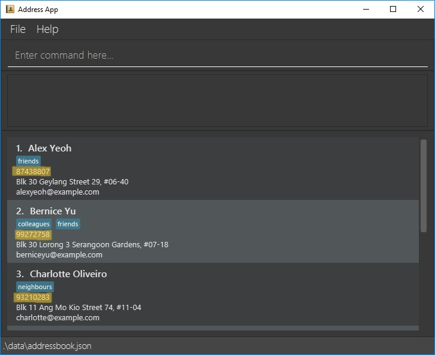

# Insurahub User Guide

Insurahub is a **desktop app for managing clients, optimized for use via a Command Line Interface** (CLI) while still having the benefits of a Graphical User Interface (GUI). If you can type fast, Insurahub can get your contact management tasks done faster than traditional GUI apps. This app is mainly used by insurance agents who have many clients and tasks such as appointments to keep track of on a daily basis.

<!-- * Table of Contents -->
<page-nav-print />

--------------------------------------------------------------------------------------------------------------------

## Quick start

1. Ensure you have Java `11` or above installed in your Computer.

1. Download the latest `insurahub.jar` from [here](https://github.com//AY2324S1-CS2103-W14-1/tp).

1. Copy the file to the folder you want to use as the _home folder_ for your App.

1. Open a command terminal, `cd` into the folder you put the jar file in, and use the `java -jar insurahub.jar` command to run the application. 
   A GUI similar to the below should appear in a few seconds. Note how the app contains some sample data. 
   

1. Type the command in the command box and press Enter to execute it. e.g. typing **`help`** and pressing Enter will open the help window. 
   Some example commands you can try:

   * `list` : Lists all contacts.

   * `add n/John Doe p/98765432 e/johnd@example.com a/John street, block 123, #01-01` : Adds a contact named `John Doe` to the application.
     
   * `addTag 1 t/classmate` : Adds a "classmate" tag to the first user in the address book.

   * `delete 3` : Deletes the 3rd contact shown in the current list.
  
   * `deleteTag 1 t/classmate` : Deletes the "classmate" tag from the first user in the address book if the "classmate" tag currently exists

   * `clear` : Deletes all contacts.

   * `exit` : Exits the app.
     
   * `file 1`: Creates a folder for the first person in the address book with the person's information
  
   * `highlight 1/phonenumber` : Highlight/Bold to show that that is the main form of contact that the client in the first index prefers. 

1. Refer to the [Features](#features) below for details of each command.

--------------------------------------------------------------------------------------------------------------------

## Features

<box type="info" seamless>

**Notes about the command format:** 

* Words in `UPPER_CASE` are the parameters to be supplied by the user. 
  e.g. in `add n/NAME`, `NAME` is a parameter which can be used as `add n/John Doe`.

* Items in square brackets are optional. 
  e.g `n/NAME [t/TAG]` can be used as `n/John Doe t/friend` or as `n/John Doe`.

* Items with `…`​ after them can be used multiple times including zero times. 
  e.g. `[t/TAG]…​` can be used as ` ` (i.e. 0 times), `t/friend`, `t/friend t/family` etc.

* Parameters can be in any order. 
  e.g. if the command specifies `n/NAME p/PHONE_NUMBER`, `p/PHONE_NUMBER n/NAME` is also acceptable.

* Extraneous parameters for commands that do not take in parameters (such as `help`, `list`, `exit` and `clear`) will be ignored. 
  e.g. if the command specifies `help 123`, it will be interpreted as `help`.

* If you are using a PDF version of this document, be careful when copying and pasting commands that span multiple lines as space characters surrounding line-breaks may be omitted when copied over to the application.
</box>

### Viewing help : `help`

Shows a message explaning how to access the help page.

Format: `help`

### Adding a new client: `addNewClient`

Adds a new client to the address book.

Format: `addNewClient/FIRSTNAME/LASTNAME/PRIMARYPHONENUMBER/ADDRESS/EMAIL`

<box type="tip" seamless>

Examples:
* `addNewClient/Johnny/Snake/91234567/Blk 69 Geylang Street 12, #12-69/johnnythesnake12@gmail.com`
* `addNewClient/Betsy/Crowe/92222222/Newgate Prison/betsycrowe@example.com`

### Listing all persons : `list`

Shows a list of all persons in the address book.

Format: `list`

### Editing a person : `edit`

Edits an existing person in the address book.

Format: `edit INDEX [n/NAME] [p/PHONE] [e/EMAIL] [a/ADDRESS] [t/TAG]…​`

* Edits the person at the specified `INDEX`. The index refers to the index number shown in the displayed person list. The index **must be a positive integer** 1, 2, 3, …​
* At least one of the optional fields must be provided.
* Existing values will be updated to the input values.
* When editing tags, the existing tags of the person will be removed i.e adding of tags is not cumulative.
* You can remove all the person’s tags by typing `t/` without
    specifying any tags after it.

Examples:
*  `edit 1 p/91234567 e/johndoe@example.com` Edits the phone number and email address of the 1st person to be `91234567` and `johndoe@example.com` respectively.
*  `edit 2 n/Betsy Crower t/` Edits the name of the 2nd person to be `Betsy Crower` and clears all existing tags.

### Locating persons by name: `find`

Finds persons whose names contain any of the given keywords.

Format: `find KEYWORD [MORE_KEYWORDS]`

* The search is case-insensitive. e.g `hans` will match `Hans`
* The order of the keywords does not matter. e.g. `Hans Bo` will match `Bo Hans`
* Only the name is searched.
* Only full words will be matched e.g. `Han` will not match `Hans`
* Persons matching at least one keyword will be returned (i.e. `OR` search).
  e.g. `Hans Bo` will return `Hans Gruber`, `Bo Yang`

Examples:
* `find John` returns `john` and `John Doe`
* `find alex david` returns `Alex Yeoh`, `David Li` 
  

### Deleting a person : `delete`

Deletes the specified person from the address book.

Format: `delete INDEX`

* Deletes the person at the specified `INDEX`.
* The index refers to the index number shown in the displayed person list.
* The index **must be a positive integer** 1, 2, 3, …​

Examples:
* `list` followed by `delete 2` deletes the 2nd person in the address book.
* `find Betsy` followed by `delete 1` deletes the 1st person in the results of the `find` command.

### Clearing all entries : `clear`

Clears all entries from the address book.

Format: `clear`

### Exiting the program : `exit`

Exits the program.

Format: `exit`

### Saving the data

AddressBook data are saved in the hard disk automatically after any command that changes the data. There is no need to save manually.

### Editing the data file

AddressBook data are saved automatically as a JSON file `[JAR file location]/data/addressbook.json`. Advanced users are welcome to update data directly by editing that data file.

<box type="warning" seamless>

**Caution:**
If your changes to the data file makes its format invalid, AddressBook will discard all data and start with an empty data file at the next run.  Hence, it is recommended to take a backup of the file before editing it.
</box>

## In Progress

### Adding tags to a client object: `addTag`

Adds any number of new tags to a client object without deleting the pre-exisiting tags.

Format 1: `addTag <tag1>/<tag2> /<INDEX>`

Format 2:  `addTag <tag1>/<tag2> /<client identifier>`

* **INDEX** must be a positive integer less than or equals to the number of clients currently shown on Insurahub.
* **client identifier** must be one of the unique identifier of the clients in the entire client list
* **tag**: must be a valid tag in the pre-defined list implemented in the app

Examples:
* `addTag friend 1` will add the tag 'friend' to the first client on the current list.
* `addTag friend/North JohnDoe` will add the tags 'friend', 'North' to the client identified by John Doe.

### Deleting tags from a client object: `deleteTag`

Removes any number of pre-existing tags from a client object.

Format 1: `deleteTag <tag1>/<tag2> /<INDEX>`

Format 2:  `deleteTag <tag1>/<tag2> /<client identifier>`

* **INDEX** must be a positive integer less than or equals to the number of clients currently shown on Insurahub.
* **client identifier** must be one of the unique identifier of the clients in the entire client list
* * **tag**: must be a valid tag in the pre-defined list implemented in the app

Examples:
* `deleteTag friend 1` will remove the tag 'friend' from the first client on the current list.
* `deleteTag friend/North JohnDoe` will remove the tags 'friend', 'North' from the client identified by John Doe.

### Highlighting contact of a client: `highlight`  

Highlight the specific contact details of the particular client from the application.

Format 1: `highlight <INDEX>/<preferred contact method>`  

Format 2:  `highlight <client identifier>/<preferred contact method>`

* **INDEX** must be a positive integer less than or equals to the number of clients currently shown on Insurahub.
* **client identifier** must be one of the unique identifier of the clients in the entire client list
* **preferred contact method** either Phone number or Email currently
* Name: Contact name of the person that is saved in the app.
* Preferred contact method(expandable as project progresses):
    * Phone number
    * Email
 
Examples:
* `highlight 1/phone number` will highlight the phone number of the first person in the current list shown
* `highlight John Doe/phone number` will highlight John Doe phone number

### Filtering for clients based on tags: `filter`

Filters and displays all clients that correspond to a specific combination/query of tags

Format 1: `filter <tag1>/<tag2>/ … /<tagn>` 

* **tag**: must be a valid tag in the pre-defined list implemented in the app

Examples:
* `filter friend/south/60+` will filter for all clients with the tags 'friend', 'south', '60+'

### Storing documents of a client: `file`

Creates/opens up a folder specific to a client for storing of their documents

Format 1: `file <INDEX>`

Format 2:  `file <client identifier>`

* **INDEX** must be a positive integer less than or equals to the number of clients currently shown on Insurahub.
* **client identifier** must be one of the unique identifier of the clients in the entire client list

Examples:
* `file 1` will open up a folder that is named after the first client currently on the list
* `file John Doe` will open up the folder that is used to store John Doe's documents

--------------------------------------------------------------------------------------------------------------------

## FAQ

**Q**: How do I transfer my data to another Computer? 
**A**: Install the app in the other computer and overwrite the empty data file it creates with the file that contains the data of your previous AddressBook home folder.

--------------------------------------------------------------------------------------------------------------------

## Known issues

1. **When using multiple screens**, if you move the application to a secondary screen, and later switch to using only the primary screen, the GUI will open off-screen. The remedy is to delete the `preferences.json` file created by the application before running the application again.

--------------------------------------------------------------------------------------------------------------------

## Command summary

Action     | Format, Examples
-----------|----------------------------------------------------------------------------------------------------------------------------------------------------------------------
**Add**    | `add n/NAME p/PHONE_NUMBER e/EMAIL a/ADDRESS [t/TAG]…​`   e.g., `add n/James Ho p/22224444 e/jamesho@example.com a/123, Clementi Rd, 1234665 t/friend t/colleague`
**Clear**  | `clear`
**Delete** | `delete INDEX`  e.g., `delete 3`
**Edit**   | `edit INDEX [n/NAME] [p/PHONE_NUMBER] [e/EMAIL] [a/ADDRESS] [t/TAG]…​`  e.g.,`edit 2 n/James Lee e/jameslee@example.com`
**Find**   | `find KEYWORD [MORE_KEYWORDS]`  e.g., `find James Jake`
**List**   | `list`
**Help**   | `help`
